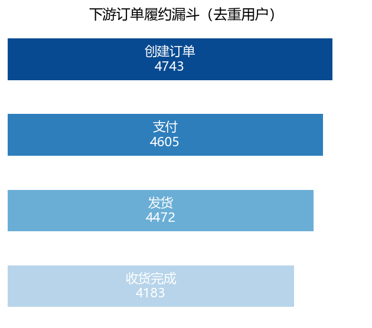
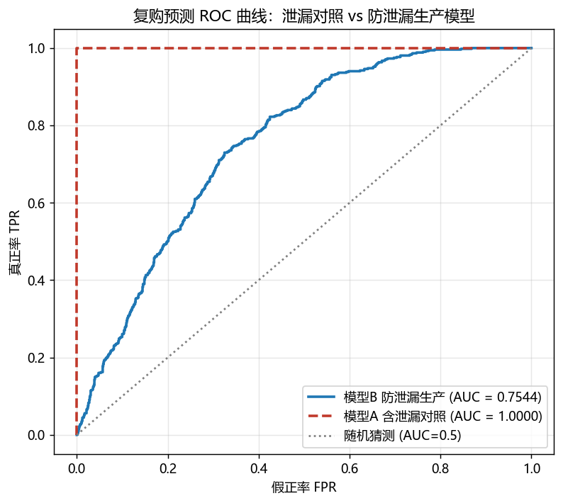

# 淘宝电商用户消费数据分析与复购预测

> 基于 MySQL 6 表关系数据 + Python/Pandas + 机器学习，对电商用户从「经营健康度诊断 → 复购因子挖掘 → 复购预测 → 购买意向与商品推荐 → 会员分层运营」的端到端分析项目。
>
> 本项目为**学习 / 面试作品集用途的方法演示项目**，重在沉淀可复用的分析流程与建模方法论，非商业生产系统。

---

## 目录

- [项目简介](#项目简介)
- [核心任务与亮点](#核心任务与亮点)
- [数据来源说明](#数据来源说明)
- [数据模型（6 表）](#数据模型6-表)
- [技术栈](#技术栈)
- [项目结构](#项目结构)
- [快速开始（复现步骤）](#快速开始复现步骤)
- [运行结果速览](#运行结果速览)
- [方法要点](#方法要点)
- [注意事项与已知限制](#注意事项与已知限制)

---

## 项目简介

电商平台每天产生大量「浏览 → 点击 → 收藏 → 加购 → 下单 → 支付 → 收货 → 复购」行为数据。本项目以淘宝典型交易场景为背景，围绕 **用户、商品、订单、行为** 四类业务对象建立关系型数据模型，并用一套递进的分析任务回答业务问题：

1. **平台经营是否健康？** —— GMV/营收/让利、地域与会员结构、商品 ABC、转化漏斗
2. **用户为什么流失 / 复购？** —— 复购驱动因素的统计显著性检验
3. **谁会复购？** —— 防目标泄漏的随机森林复购预测 + 概率校准
4. **该给用户推什么？** —— 购买意向回归 + 双商品池智能推荐
5. **运营怎么落地？** —— RFM 思想下的 V/P/S 会员分层与召回、促销策略

每个任务都有**可直接投放的名单/策略产出**，而非只停留在图表结论。

## 核心任务与亮点

| # | 任务 | 主要脚本 | 核心产出 |
|---|------|---------|---------|
| 1 | 经营健康度诊断 | `analysis/diagnose.py` | 健康度报告 + 漏斗 / ABC / 帕累托图 |
| 2 | 复购影响因素诊断 | `analysis/repurchase.py` | 因子报告（t 检验 / Pearson / 卡方） |
| 3 | 复购预测模型（防泄漏） | `analysis/repurchase_model.py` | AUC≈0.7544 模型 + 用户复购概率分 |
| 4 | 购买意向 + 商品推荐 | `analysis/purchase_intent_model.py` | 意向分 + 爆款/高价值双池推荐名单 |
| 5 | 会员分层运营方案 | `analysis/ops_plan.py` | V/P/S 分层名单 + 优惠券 / 捆绑策略 |

**项目亮点：**
- 🛡️ **目标泄漏防控**：A/B 双模型对照实验，证明 `order_frequency` 等"结果型"特征会使 AUC 虚高到 ≈1.0，据此构建防泄漏特征集得到可用模型 AUC≈0.7544；
- 🎯 **概率校准**：对随机森林输出做 Platt（sigmoid）缩放，使"复购概率 0.72"可直接用于运营圈人；
- 🔗 **多表关联取数**：SQL（JOIN / 窗口函数 / CTE / 聚合下推）与 Pandas `merge` 组合，处理 6 表 1 对 1 / 1 对多关联；
- 📐 **口径治理**：全项目统一"有效订单 = 已付款/已发货/已收货/已完成"口径，支持 GMV/营收/让利跨表对账；
- 🤝 **统计与业务结合**：Welch t 检验 / Pearson 相关 / 卡方 + Cramér's V 量化复购因素，并将结论转成分层运营动作。

## 数据来源说明

- **数据来源：阿里云天池数据集**（公开数据集，供学习 / 竞赛 / 科研用途）。
- 本项目在天池公开数据基础上进行了 **抽样、脱敏、衍生加工**：构造了订单状态、会员等级、消费/商品特征等衍生字段，聚合出 `user_features` / `product_features` 等宽表，统一编码为中文业务口径，并以 MySQL `taobao_data` 存储、只读分析。
- 数据为**方法演示用途**，不代表任何真实平台 / 商家经营情况；分析重点在可迁移的**方法与流程**。
- 全库数据规模（共 6 表、约 5.9 万行）：

| 表 | 行数 | 说明 |
|----|-----|------|
| `users` | 5,000 | 用户基础信息（画像 / 会员） |
| `user_features` | 5,000 | 用户消费 / 行为聚合特征（宽表） |
| `user_behaviors` | 30,000 | 用户行为明细（浏览/点击/收藏/加购） |
| `products` | 2,000 | 商品基础信息 |
| `product_features` | 2,000 | 商品运营指标（宽表） |
| `orders` | 15,000 | 订单明细（含状态 / 金额 / 评价） |

## 数据模型（6 表）

```
用户域                     商品域
users(5000) ─── 1:1 ─── user_features(5000)     products(2000) ─── 1:1 ─── product_features(2000)
   │  ▲                                              │  ▲
   │  └──── user_id（主外键，ON DELETE CASCADE）──────┘
   │                                                   │
明细域（仅建索引，不建外键，保写入性能）
   │
   ├── orders(15000)        user_id / product_id / order_date 均建索引
   └── user_behaviors(30000) user_id / product_id 建索引
```

- 维表 `users` / `products` 与其特征表间建立真正的外键约束（`ON DELETE CASCADE`）；
- 明细表 `orders` / `user_behaviors` 高频写入，只建索引不建外键（权衡写入性能与约束成本）；
- 表结构与字段注释见 [`sql代码`](./sql代码)（建库建表 DDL + 多表关联查询示例）。

## 技术栈

- **语言 / 数据**：Python 3、Pandas、NumPy
- **数据库**：MySQL 8（utf8mb4）、SQLAlchemy、PyMySQL、SQL（JOIN / 窗口函数 / CTE / 索引）
- **机器学习**：scikit-learn（RandomForest 分类/回归、train_test_split、CalibratedClassifierCV 概率校准、评估指标）
- **统计**：SciPy `scipy.stats`（Welch t 检验、卡方检验 + Cramér's V）
- **可视化**：matplotlib（Agg 无头后端，批量输出 PNG）
- **交付**：Markdown 报告 + CSV（`utf-8-sig`，可直接用 Excel 打开）

## 项目结构

```
taobao_data_analysis/
├── README.md                     # 本文件
├── Python_input.py               # CSV -> MySQL 批量导入脚本（含建表/校验/列名映射）
├── sql代码                        # 建库建表 DDL + 多表关联取数查询（供 MySQL 端执行）
├── taobao_data/                  # 源数据 CSV（6 张表）
│   ├── users.csv
│   ├── products.csv
│   ├── user_features.csv
│   ├── product_features.csv
│   ├── user_behaviors.csv
│   └── orders.csv
└── analysis/
    ├── diagnose.py               # 任务1：经营健康度诊断
    ├── repurchase.py             # 任务2：复购影响因素诊断
    ├── repurchase_model.py       # 任务3：复购预测模型（防泄漏）
    ├── purchase_intent_model.py  # 任务4：购买意向 + 商品推荐
    ├── ops_plan.py               # 任务5：会员分层运营方案
    ├── meta.py / meta2.py / meta3.py   # 只读数据探查脚本（可选）
    └── output/                   # 全部产出
        ├── *.md                  # 5 份中文分析报告
        ├── *.csv                 # 7 份可直接投放的名单/结果
        └── imgs/                 # 21 张图表（漏斗/ABC/热力图/ROC 等）
```

> `meta*.py` 为开发期只读探查脚本，非正式交付链路，可忽略。

## 快速开始（复现步骤）

### 1. 环境准备

```bash
pip install pandas numpy sqlalchemy pymysql scikit-learn scipy matplotlib
```

需要本机已安装并启动 MySQL（本项目默认 `127.0.0.1:3306`，库 `taobao_data`）。

### 2. 修改配置

编辑 [`Python_input.py`](./Python_input.py) 顶部的配置区：

```python
MYSQL_PWD = "数据库密码" 
SQL_CODE_PATH = r"...\taobao_data_analysis\sql代码"   # 改为你本机绝对路径
BASE_PATH     = r"...\taobao_data_analysis\taobao_data"
EXECUTE_SQL_FIRST = True        # True = 先执行 sql代码 建表再导入
```

### 3. 导入数据

```bash
python Python_input.py
```

导入顺序已按外键依赖处理（先维表 `users/products`，后明细 `orders/user_behaviors`）。

### 4. 按任务顺序运行分析

```bash
cd analysis
python diagnose.py               # 任务1：健康度
python repurchase.py             # 任务2：复购因子
python repurchase_model.py       # 任务3：复购模型（生成 repurchase_user_scores.csv）
python purchase_intent_model.py  # 任务4：意向 + 推荐
python ops_plan.py               # 任务5：运营方案（会读取任务3 的输出分）
```

> 建议顺序如上 —— `ops_plan.py` 依赖任务 3 生成的 `repurchase_user_scores.csv`。

### 5. 查看结果

所有报告 / 名单 / 图表输出在 `analysis/output/` 下（详见下表）。

## 运行结果速览

### 关键数字

| 指标 | 数值 |
|------|------|
| GMV / 实际营收 / 折扣让利 | 4585 万 / 3903 万 / 682 万（14.9%） |
| 有效订单 → 交易完成 | 12,765 → 9,058 单 |
| 复购率 | 34.6%（1,728 / 5,000 用户） |
| 复购预测模型（防泄漏版） | AUC ≈ 0.7544（Acc .698 / Prec .574 / Rec .488 / F1 .528） |
| 泄漏对照（model A） | AUC ≈ 1.0（自检暴露 order_frequency 泄漏） |
| Top 特征 | total_spent / avg_order_amount / account_balance / credit_score / age |
| 用户分层 | 低活跃 3,150（63%）/ 中 923 / 高 927（高消费 31.8% → 71.3% 营收） |
| 商品 ABC | A 类 718 个商品 → 约 80% 营收 |
| 漏斗最大流失 | 浏览 → 点击（损耗 17.1%） |

### 输出文件清单

| 文件（analysis/output/） | 内容 |
|---|---|
| `电商经营健康度诊断报告.md` | 健康度全景 + 漏斗 + ABC |
| `用户复购影响因素诊断报告.md` | 复购驱动因素检验结果 |
| `用户复购预测模型报告_防泄漏生产版.md` | 建模 / 防泄漏对照 / 校准 |
| `用户购买意向回归预测 & 商品智能推荐报告.md` | 意向回归 + 双商品池推荐 |
| `会员精细化运营与增长策略方案.md` | V/P/S 分层与运营策略 |
| `repurchase_user_scores.csv` 等 7 个 CSV | 复购分 / 意向分 / 商品池 / 推荐 / 分层 / 召回 / 捆绑名单 |

示例图表（更多见 `analysis/output/imgs/`）：

| 漏斗分析 | 复购模型 ROC |
|---|---|
|  |  |

## 方法要点

- **防目标泄漏（最重要）**：训练前先做 A/B 对照 —— 含 `order_frequency` 等与标签同源的列时自检 AUC≈1.0，说明模型"偷看了答案"；剔除后才是可用模型。上线特征集只保留"原因型"特征。
- **概率校准**：`CalibratedClassifierCV(method="sigmoid", cv=3)` 将 RF 输出校准为真实概率，便于按阈值分层圈人。
- **多表关联策略**：口径型 / 大表查询下沉到 SQL（JOIN、窗口函数、CTE、先 DISTINCT 防一对多放大、聚合下推），建模特征工程用 Pandas `merge`；跨表做行数与金额对账。
- **统计显著性 + 效应量**：连续变量 Welch t 检验与 Pearson r、分类变量卡方 + Cramér's V，避免"样本大导致弱相关也显著"的误读。
- **诚实呈现**：对仿真数据、回归 R²≈0 等不理想结果如实披露并给出替代方案（转向基于真实分层 + 双商品池推荐）。

## 注意事项与已知限制

1. **凭据**：`Python_input.py` 中的数据库密码为占位符，请改为本地密码；**提交 GitHub 前请勿提交真实账号密码**，可改为读取环境变量。
2. **绝对路径**：导入脚本内含本机绝对路径，换环境需按上文修改。
3. **数据性质**：数据来源于阿里云天池公开数据集并经衍生加工，为方法演示用途；报告中的数值（如过高的浏览→成交率）不代表真实业务，重点在方法。
4. **模型范围**：当前使用随机森林作基线；如需更强性能可替换为 LightGBM/XGBoost + 超参搜索 + 交叉验证（见报告"后续方向"）。

---

## License

项目仅供学习交流。如需开源引用请注明出处；请勿商用。
