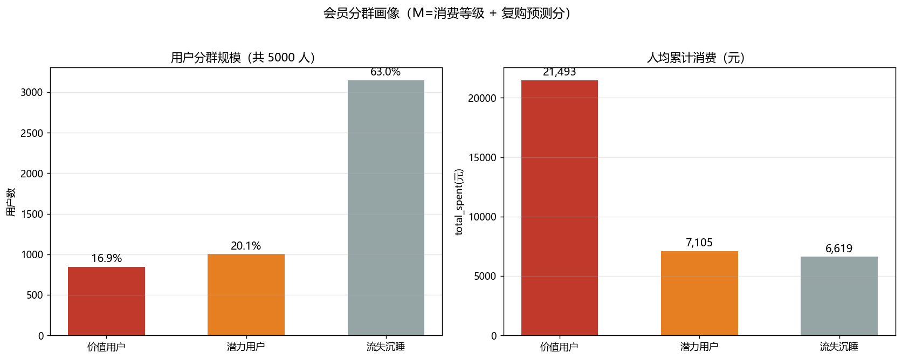
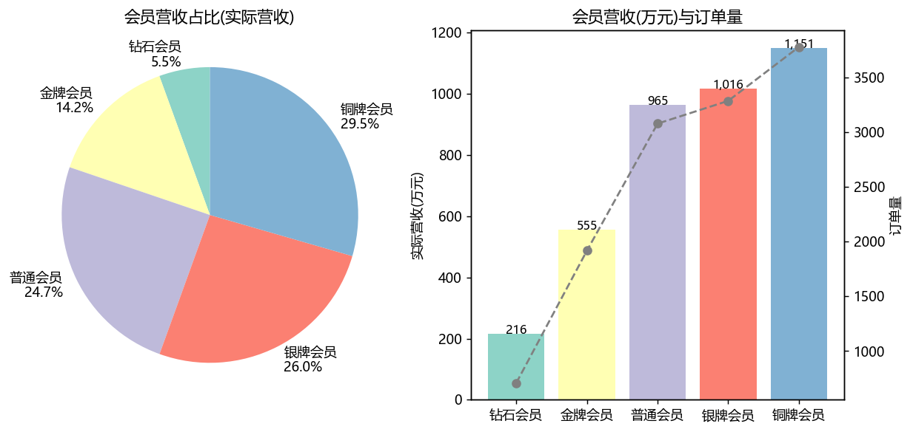
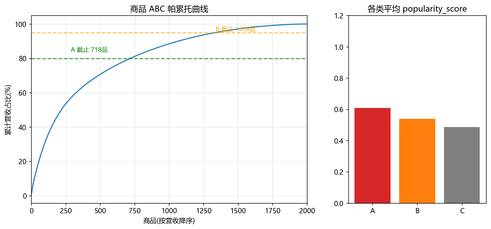
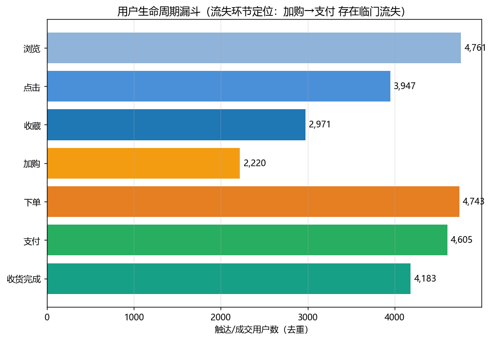

# 会员精细化运营与增长策略方案（综合落地）

> **定位**：基于任务1~4 的完整分析（健康度大盘、复购影响因素、复购预测模型、购买意向与商品推荐），产出 4 套可直接执行的运营策略。数据口径与明细见附录。
> **数据底座**：用户 5000｜有效成交订单 12,765 笔｜商品 2000 款｜全量复购率 34.6%。

## 0 执行摘要（TL;DR）

- **用户分层**（RFM 优化：消费等级 M + 复购预测分 F/R）：价值用户 846 人（高消费+高复购分，人均消费 21,493 元、复购率 86.5%）；潜力用户 1004 人；流失沉睡 3150 人（63.0%，其中从未下单 1395 人、仅 1 单 1581 人）。
- **四套策略**：①高价值会员留存（专属权益防流失）；②沉睡/低复购唤醒（分层优惠券，名单已导出）；③滞销商品清库存（C 类×同品类爆款捆绑促销）；④流量转化提升（加购未支付/未下单 限时券 + 上游意向召回）。
- **优先级建议**：先跑 ④（临门一脚，见效最快、成本最低）与 ②（沉睡池最大，唤醒即增量）→ 再上 ③（清库存回笼资金）→ ① 常态化维护。

## 1 用户资产盘点与分群

### 1.1 分群口径（RFM 优化）

| 维度 | 数据来源 | 说明 |
|---|---|---|
| M 消费金额 | 自带 `consumption_level`（高 1589 / 中 1890 / 低 1521）| 帕累托：31.8% 高消费用户贡献 71.3% 营收 |
| F 频次 | `order_frequency`（0单 1469 / 1单 1803 / ≥2次复购 1728）| 复购=至少完成 2 次购买 |
| R/F 预测 | 任务3 复购预测分（防泄漏模型，样本外 AUC≈0.75）| 前瞻性“还会不会复购” |
| 沉睡标记 | 0 单或仅 1 单 且 预测分低 | 需唤醒 |

### 1.2 三群画像

| 分层 | 判定规则 | 人数 | 占比 | 人均消费 | 平均频次 | 复购率 | 复购预测分 |
|---|---|---:|---:|---:|---:|---:|---:|
| 价值用户 | 消费等级=高 & 复购分≥0.5 | 846 | 16.9% | 21,493 | 2.43 | 86.5% | 0.735 |
| 潜力用户 | 复购分≥0.4 且非价值（多为中消费） | 1004 | 20.1% | 7,105 | 2.06 | 81.9% | 0.638 |
| 流失沉睡 | 复购分<0.4（含 0 单/仅 1 单） | 3150 | 63.0% | 6,619 | 0.62 | 5.5% | 0.166 |

- 价值用户（846 人）会员结构：钻石 6% / 金牌 15% / 银牌 28% / 铜牌 29% / 普通 22%。
- 会员营收贡献（有效成交）：

| 会员等级 | 消费人数 | 营收占比% |
|---|---|---|
| 铜牌会员 | 1355 | 29.50 |
| 银牌会员 | 1194 | 26.00 |
| 普通会员 | 1107 | 24.70 |
| 金牌会员 | 688 | 14.20 |
| 钻石会员 | 261 | 5.50 |

## 2 策略一：高价值会员留存（维护存量基本盘）

**人群**：价值用户 846 人（贡献高营收的头部，人均消费 21,493 元、复购率 86.5%）。**目标**：降流失、提年消费、做口碑。

| 动作 | 机制 | 承接权益 |
|---|---|---|
| 专属身份 | 钻石/金牌高价值直通，免运费、专属客服、新品优先购 | 提升离店成本 |
| 付费锁客 | 年卡/季卡（含 0 门槛包邮+专属折扣），用“已付会员费”锚定消费 | 提高跨品类复购 |
| 关怀触发 | 生日礼券、30 天未消费自动送关怀券（额度高于沉睡档以免被低估）| 防止高价值掉档 |
| 价值上探 | 高价值×高意向：按任务4 商品池推其偏好类目的**爆款高转化品** | 客单提升 |
| 客户成功 | 大额异常（仅退款/客诉）48h 专人跟进 | 保口碑 |
**KPI**：会员流失率≤3%/季；高价值人均年消费 +15%；付费会员续费率≥60%。

## 3 策略二：沉睡低复购用户唤醒（优惠券触达）

**人群**：流失沉睡 3150 人（占比 63.0%）+ 潜力用户 1004 人。沉睡内部：从未下单 1395、仅 1 单 1581（有信任基础，唤醒性价比更高）。

| 子人群 | 触达券 | 有效期/渠道 | 目标 |
|---|---|---|---|
| 从未下单（1395 人）| 首单大额券 满100-50 | 7 天｜App push+短信 | 破首单 |
| 仅1单未复购（1581 人）| 复购唤醒券 满300-80 | 14 天｜短信+站内信 | 促成第2单 |
| 潜力用户（1004 人，中等消费）| 小额升档券 满200-30 | 30 天｜App | 复购并提客单 |
- 投放节奏：分 3 批每批间隔 3 天，避免疲劳；券后埋点归因，看核销率与券后复购率。
- 名单已导出 `ops_user_segments.csv`（含 user_id/分层/券建议），可直接圈选推送。

**示例测算（假设标注，非实证）**：若唤醒券核销率 10~15%、增量复购率 5~8%，沉睡 3150 人约可带来 150~250 个增量第 1/2 单；按客单价 6619 元估算撬动营收数十万元量级，ROI 需以实际核销回收为准。

## 4 策略三：滞销商品清库存

### 4.1 商品 ABC 分层（营收口径）

| 类别 | 商品数 | 营收占比% | 平均popularity |
|---|---|---|---|
| A | 728 | 80.00 | 0.61 |
| B | 621 | 15.00 | 0.54 |
| C | 651 | 5.00 | 0.48 |

- **爆款(A 类 728 款，80% 营收)**：持续投流量、保排名、做组合引流款；
- **长尾(B 类 621 款)**：按需补货，配合券促销做“腰部提量”；
- **滞销(C 类 651 款，5% 营收)**：清库存主战场。

### 4.2 清库存玩法（滞销×爆款捆绑）

- 候选池：C 类且真实完成单≤1 的商品（170 款）——动销差、占仓储、压资金。
- **捆绑促销**：同品类爆款带滞销——“买爆款 +9.9 元换购”/“爆款+滞销组合满额立减”，用爆款流量清长尾；
- **独立促销**：滞销区满减+大额券叠加清库，价格带参考其类目折扣上限；
- **搭配销售**：与高意向用户（任务4）偏好类目的价值池/高性价比池联动推荐。

捆绑组合样例（每类目 1 组，全量见 `ops_slow_bundles.csv`）：

| 类目 | 引流爆款 | 滞销品 | 爆款营收(元) | 滞销营收(元) |
|---|---|---|---|---|
| 箱包配饰 | 外交官箱包配饰商品687 | GUCCI箱包配饰商品259 | 32197.04 | 9.57 |
| 宠物用品 | 比瑞吉宠物用品商品310 | pidan宠物用品商品948 | 29746.88 | 150.39 |
| 图书音像 | 人民邮电出版社图书音像商品522 | 博库网图书音像商品736 | 28116.66 | 167.12 |
| 食品生鲜 | 五粮液食品生鲜商品281 | 良品铺子食品生鲜商品410 | 32123.98 | 262.04 |
| 医药保健 | 善存医药保健商品975 | Swisse医药保健商品173 | 28335.44 | 333.87 |
| 家居家装 | 顾家家居家居家装商品822 | 全友家居家居家装商品556 | 28803.21 | 351.17 |
| 服装鞋包 | ZARA服装鞋包商品284 | 耐克服装鞋包商品711 | 58056.10 | 461.81 |
| 运动户外 | 探路者运动户外商品701 | 探路者运动户外商品348 | 25385.38 | 750.79 |
| 母婴用品 | 花王母婴用品商品653 | 强生母婴用品商品257 | 29798.85 | 868.50 |
| 礼品鲜花 | 诺誓礼品鲜花商品754 | 野兽派礼品鲜花商品275 | 27562.44 | 890.98 |
| 美妆护肤 | 雅诗兰黛美妆护肤商品194 | 完美日记美妆护肤商品612 | 76614.06 | 1121.88 |
| 手机数码 | 三星手机数码商品810 | 荣耀手机数码商品413 | 240439.03 | 2367.88 |
| 珠宝首饰 | 六福珠宝珠宝首饰商品339 | 潘多拉珠宝首饰商品187 | 64321.98 | 2848.20 |
| 汽车用品 | 海康威视汽车用品商品432 | 博世汽车用品商品954 | 240474.59 | 4584.31 |

**KPI**：季度 C 类动销率 +10pct、清库资金回笼率、滞销占用降低。

## 5 策略四：流量转化提升（流失环节优化）

### 5.1 环节流失测算（用户去重口径）

| 环节 | 用户数 | 说明 |
|---|---:|---|
| 浏览 | 4,761 | 认知层 |
| 点击 | 3,947 | 点击率 82.9%（流失 1,002 人未点击）|
| 收藏/加购 | 2,971 / 2,220 | 高意向信号 |
| 下单 | 4,743 | 其中未支付 138 人 |
| 支付 | 4,605 | 下单→支付 97.1% |
| 收货完成 | 4,183 | 履约层 |

**流失定位**：最大的人群级漏点在**“看→加购”上游（浏览未加购为主）**与**“加购→支付”临门流失**；其中 加购未下单 109 人、加购未支付 163 人（已并入 306 人“收藏/加购但从未支付”高意向池）、下单未支付 138 人。加购到下单链条是**转化意愿最强、召回成本最低**的环节。

### 5.2 动作清单

| 优先级 | 人群 | 动作 | 预期 |
|---|---|---|---|
| P0 | 加购/收藏未支付 306 人 | **限时优惠券**（如 满200-60/免邮，12~24h 有效期）+ 库存紧张提醒 | 临门转化，见效最快 |
| P0 | 加购但从未下单 109 人 | 限时券+组合购（绑定其浏览爆款）| 破单 |
| P1 | 下单未支付 138 人 | 自动催付短信（30/120 分钟两波）| 挽回支付 |
| P2 | 浏览未点击/点击未加购 2,219 人 | 内容种草+价格锚点+推荐位优化（兴趣→加购）| 扩大上层池子 |
- 加购未支付/未下单召回名单已导出 `ops_cart_recovery.csv`，可直接圈选发放限时券。

**KPI**：加购未支付转化率提升至 15%+；整体 浏览→成交 转化率环比提升 1~2pct。

## 6 排期、预算与风险

| 阶段 | 内容 | 周期 | 负责 |
|---|---|---|---|
| Phase 1 | 策略④ 加购召回 + 策略② 沉睡券 | 第 1-2 周 | 运营+增长 |
| Phase 2 | 策略③ 滞销捆绑清库 | 第 2-4 周 | 采销+类目运营 |
| Phase 3 | 策略① 高价值会员体系常态化 | 持续 | 会员运营 |

**预算假设**：券面额按子人群分档；建议首期预算先投 ④+②（召回ROI 最高），回收数据后再滚动放大 ③。**风险**：①过度折扣伤毛利 → 设券池上限与毛利率红线；②唤醒疲劳 → 控制频次与沉默期；③数据口径变化 → 统一以有效成交口径复盘。

## 7 数据依据与交付物

- 引用分析：`report.md`(经营大盘/漏斗/ABC)、`repurchase_report.md`(复购驱动)、`repurchase_model_report.md`(复购预测模型)、`purchase_intent_model_report.md`(意向+商品池)
- 本方案新增交付：`ops_plan.md`(本文件)、`op_segments.png`、`op_funnel_bar.png`、`ops_user_segments.csv`、`ops_cart_recovery.csv`、`ops_slow_bundles.csv`