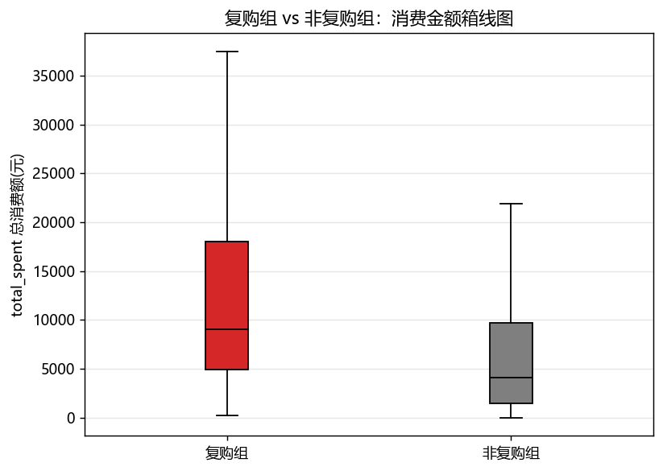
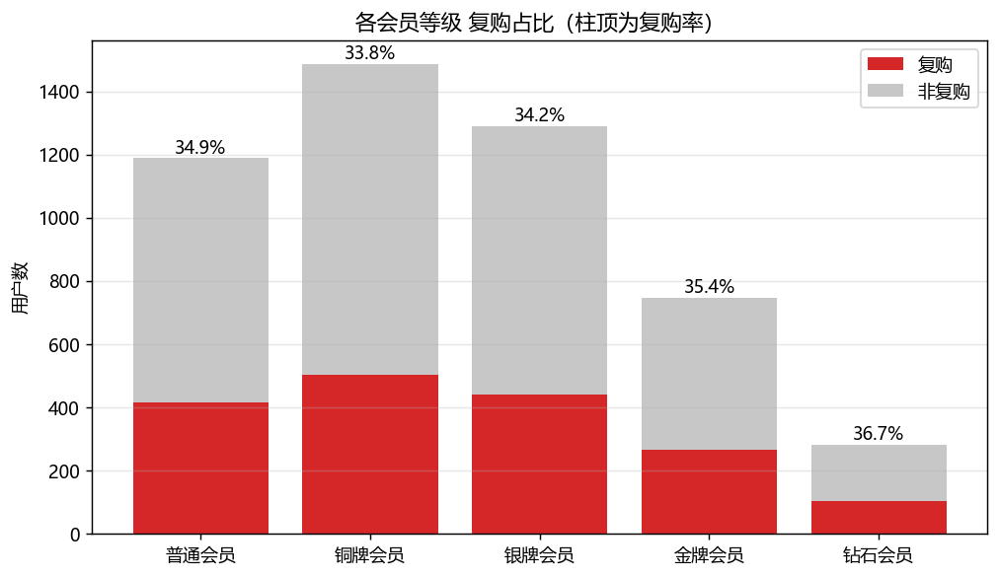
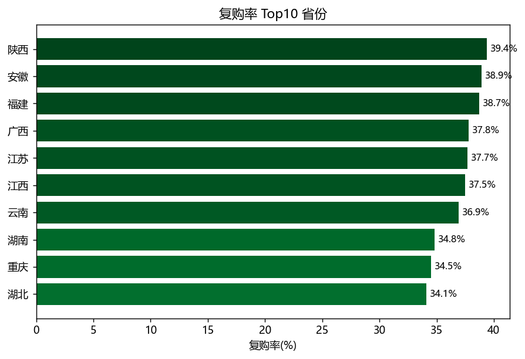
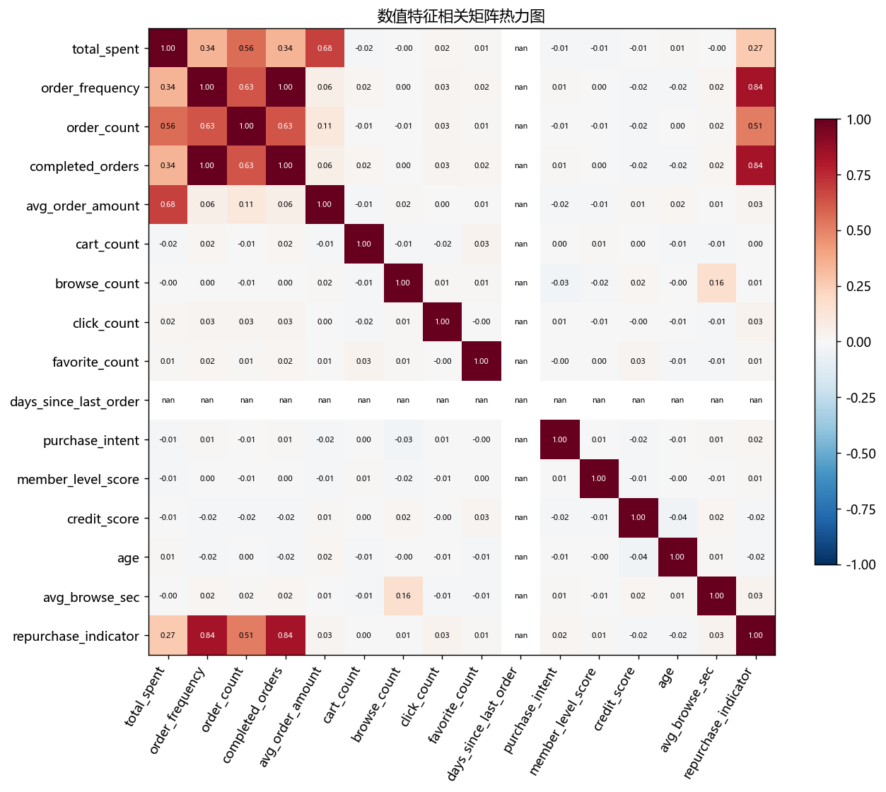
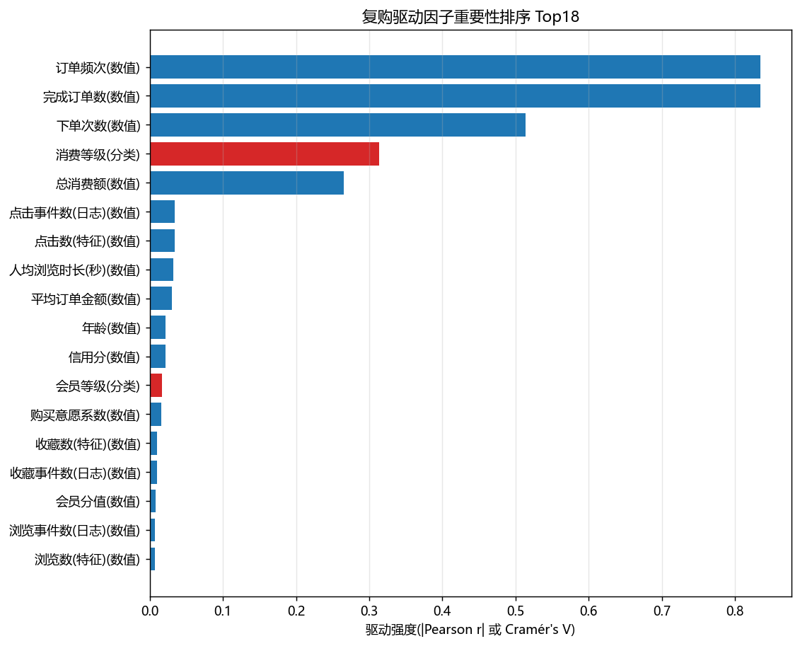

# 用户复购影响因素诊断报告

> 业务场景：复购率偏低，定位复购驱动因子
> 目标变量：`repurchase_indicator`（**0 = 不复购，1 = 复购**）
> 样本：`user_features` 全量 **5,000 人**（复购 1,728 = 34.6% / 非复购 3,272 = 65.4%）
> 数据源：MySQL `taobao_data`（只读，未改动数据）

---

## 一、核心结论速览（摘要）

1. **最强的复购驱动是“花钱与频次”**：订单频次 / 完成订单数 与复购相关性最高（r = +0.835），消费等级是**唯一显著且可干预的分类因子**（Cramér's V = 0.313，p ≈ 1e-107）。
2. **高消费人群复购率 ≈ 50%，低消费仅 ≈ 13%**。
3. **两个“直觉”在本数据中不成立（重要）**：
   - 会员等级对复购 **无显著影响**（卡方 p = 0.85，各等级复购率 33.8%~36.7% 拉平）；
   - 加购行为对复购影响可忽略（r = 0.004；有加购 35.4% vs 仅浏览 34.0%）。
4. **运营建议方向**：与其提升名义会员等级或强推加购，不如聚焦**促成用户“下第二单”+ 按实际消费分层运营**。

---

## 二、样本构建（Step1）

主表 `user_features`（含消费/行为聚合 + 目标标签），关联：

- `users` → 补充画像：年龄、性别、省份、会员等级、信用分；
- `user_behaviors`（日志）→ 汇总每用户**人均浏览时长**与浏览/点击/收藏/加购行为次数。

清洗说明：行为日志中仅“浏览 / 点击”带停留时长（浏览事件均长约 302 秒），收藏/加购时长恒为 0，故“人均浏览时长”仅按浏览事件计算；无浏览行为的用户时长记 0。`days_since_last_order` 存在哨兵值 999，未纳入相关性分析。

---

## 三、复购组 vs 非复购组对比（Step2）

| 指标 | 复购组 | 非复购组 | 方向 | t 检验 p |
|---|---:|---:|:---:|---:|
| 总消费额 total_spent | 12,831 | 7,333 | ↑ | 8.6e-70 |
| 订单频次 order_frequency | 2.48 | 0.55 | ↑ | ≈0 |
| 完成订单数 completed_orders | 2.48 | 0.55 | ↑ | ≈0 |
| 下单次数 order_count | 4.25 | 2.34 | ↑ | 6.5e-299 |
| 平均订单金额 avg_order_amount | 2,964 | 2,752 | ↑ | 0.017 |
| 点击数 click_count | 1.59 | 1.50 | ↑ | 0.017 |
| 人均浏览时长（秒） | 296.2 | 287.8 | ↑ | — |
| 浏览数 / 收藏数 | 3.00 / 0.90 | 2.98 / 0.88 | → | >0.5 |
| 加购数 cart_count | 0.59 | 0.59 | → | 0.76 |
| 信用分 | 647.3 | 650.7 | → | 0.13 |
| 年龄 | 31.5 | 31.8 | → | 0.13 |

### 会员等级 / 性别 / 地域

| 会员等级 | 复购率 | 人数 |
|---|---:|---:|
| 钻石会员 | 36.7% | 283 |
| 金牌会员 | 35.4% | 748 |
| 普通会员 | 34.9% | 1,190 |
| 银牌会员 | 34.2% | 1,291 |
| 铜牌会员 | 33.8% | 1,488 |

| 性别 | 复购率 | 人数 |
|---|---:|---:|
| 女 | 34.3% | 2,725 |
| 男 | 34.8% | 2,275 |

| 地域复购率 Top | 复购率 | 地域复购率 低 | 复购率 |
|---|---:|---|---:|
| 陕西 | 39.4% | 山西 | 32.0% |
| 安徽 | 38.9% | 四川 | 31.9% |
| 福建 | 38.7% | 山东 | 31.9% |
| 广西 | 37.8% | 辽宁 | 30.7% |
| 江苏 | 37.7% | **河南** | **28.0%** |

---

## 四、相关性与显著性检验（Step3）

### 4.1 数值特征 Pearson 相关（按 |r| 排序）

| 特征 | r | 解释 |
|---|---:|---|
| 订单频次 order_frequency | **+0.835** | 极强正相关 |
| 完成订单数 completed_orders | **+0.835** | 极强正相关 |
| 下单次数 order_count | +0.514 | 强正相关 |
| 总消费额 total_spent | +0.265 | 中正相关 |
| 点击数 click_count | +0.034 | 弱正相关（p=0.017） |
| 人均浏览时长 | +0.032 | 弱正相关 |
| 平均订单金额 | +0.030 | 弱正相关 |
| 年龄 | −0.022 | 几乎无关 |
| 信用分 | −0.021 | 几乎无关 |
| 购买意愿系数 | +0.016 | 几乎无关 |
| 收藏 / 浏览 / 加购数 | ≈0.004~0.010 | 基本无关 |

### 4.2 分类特征卡方检验

| 特征 | 卡方 | p 值 | Cramér's V | 显著性 |
|---|---:|---:|---:|:---:|
| **消费等级** | 491.1 | 2.2e-107 | **0.313** | ✅ 显著 |
| 会员等级 | 1.4 | 0.85 | 0.017 | ❌ 不显著 |
| 性别 | 0.1 | 0.75 | 0.004 | ❌ 不显著 |

> 结论示例对照：**“钻石会员复购是否显著高于普通会员？”→ 否（p=0.85）**；“高频加购用户复购率是否更高？”→ 否（差异 <1.5 pct）。

### 4.3 消费等级 × 复购交叉（最显著的分类驱动）

| 消费等级 | 不复购 | 复购 | 复购率 |
|---|---:|---:|---:|
| 高 | 799 | 790 | **49.7%** |
| 中 | 1,150 | 740 | 39.1% |
| 低 | 1,323 | 198 | **13.0%** |

---

## 五、特征重要性排序表（Step4 / 交付物）

> 数值特征用 |Pearson r|，分类特征用 Cramér's V；按强度降序。

| 排名 | 特征 | 类型 | 强度 | 方向 / 说明 |
|---|---:|---|---:|---|
| 1 | 订单频次（order_frequency） | 数值 | 0.835 | 强正相关 |
| 2 | 完成订单数（completed_orders） | 数值 | 0.835 | 强正相关 |
| 3 | 下单次数（order_count） | 数值 | 0.514 | 强正相关 |
| 4 | **消费等级（高/中/低）** | 分类 | 0.313 | 高消费复购 49.7% vs 低 13.0% |
| 5 | 总消费额（total_spent） | 数值 | 0.265 | 正相关 |
| 6 | 点击行为 | 数值 | 0.034 | 弱正相关 |
| 7 | 人均浏览时长 | 数值 | 0.032 | 弱正相关 |
| 8 | 平均订单金额 | 数值 | 0.030 | 弱正相关 |
| 9 | 年龄 | 数值 | 0.022 | 负向、几乎无关 |
| 10 | 信用分 | 数值 | 0.021 | 负向、几乎无关 |
| 11 | 会员等级 | 分类 | 0.017 | ❌ 不显著（p=0.85） |
| 12 | 收藏 / 浏览 / 加购行为 | 数值 | <0.01 | 基本无关 |
| 13 | 性别 | 分类 | 0.004 | ❌ 不显著（p=0.75） |

---

## 六、业务结论与运营建议

1. **复购的本质是“二次下单”**：订单频次 / 完成订单数 / 下单次数与标签几乎同义（复购 ≈ 下单次数 > 1），相关性高属“标签自相关”，可作为分层口径，但**不能当作可干预的前因**。
2. **可干预的真实驱动 = 消费分层**：高消费人群复购率接近 50%，是运营的“确定性增量池”→ 建议围绕高价值用户做专属权益、回访券、会员日，推动其稳定复购；对低消费（复购仅 13%）用户做唤醒与首单转化。
3. **方向纠偏（与本数据实测一致）**：本数据中**名义会员等级、加购行为、性别、信用分都不是复购驱动因子**——不宜把“升会员等级”或“强引导加购”作为复购主策略；若业务侧确有“会员升档促复购”的经验，需先校验会员体系是否与真实消费分层挂钩。
4. **次要信号**：点击行为与浏览时长呈弱正相关，说明“更多有效浏览/点击”略有利于复购，可作为内容/推荐侧的辅助抓手。

---

## 七、附录：口径与免责说明

- 分析全程只读 MySQL，未改动原始 CSV 与库内数据。
- `days_since_last_order` 存在哨兵值 999（未消费标记），已剔除，不参与相关分析。
- 该数据为**仿真业务数据**：总体复购率 34.6% 及“浏览→成交 ≈ 95%”均高于真实电商水平，本报告用于方法演练；结论方向（消费分层驱动、名义会员弱驱动）受数据本身限制，推广到真实业务前请用真实数据复核。

*配套脚本：`analysis/repurchase.py` ｜ 图表目录：`analysis/output/imgs/`*
