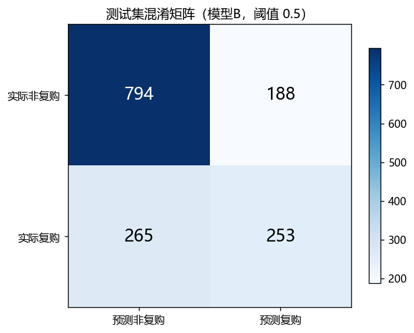
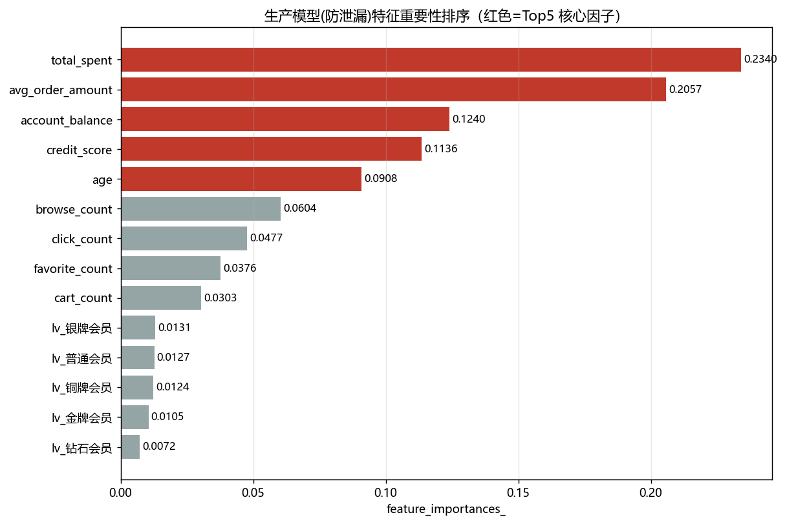
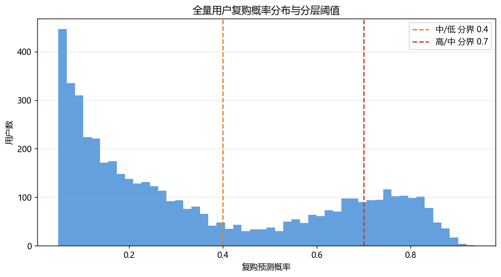

# 用户复购预测模型报告（随机森林 | 防泄漏生产版）

> 业务目标：市场部预算有限，精准筛选**未来可能复购的高潜力用户**，定向推送优惠券/会员福利。输入用户画像 + 消费 + 行为特征，预测 `repurchase_indicator`（0=不复购 / 1=复购）。样本 5000 人（复购 1728 = 34.6%）。数据源：MySQL taobao_data（只读）

## 1 特征工程与数据划分

| 特征类 | 特征 | 是否入选生产模型 |
|---|---|---|
| 用户画像 | age、member_level(独热5档)、credit_score、account_balance | ✅ |
| 消费特征 | total_spent、avg_order_amount | ✅ |
| 消费特征 | **order_count、order_frequency** | ❌ 与标签同源(泄漏) |
| 行为特征 | browse_count、click_count、favorite_count、cart_count | ✅ |
- 目标变量：`repurchase_indicator`(0/1)；7:3 划分（stratify，random_state=42），训练 3500 人 / 测试 1500 人
- 题目全特征 **16** 个；防泄漏生产特征 **14** 个（无缺失、无重复用户）

## 2 关键前置发现：目标泄漏（为何不能直接交付“满分模型”）

- 泄漏自检：**5000/5000** 样本满足 `repurchase_indicator == (order_frequency >= 2)`，且 `order_frequency == order_count` → 订单频次/订单数与标签**完全同源**。
- 把它们当特征，随机森林可拿到 Accuracy/AUC≈1.0 的“完美成绩”，但那只是**复述已有标签**，对未来营销毫无增量（特征重要性 80% 被 order_frequency 吞掉、其余≈0）。
- **处理**：正式交付采用**模型B**（剔除 order_frequency/order_count 的防泄漏模型 + Platt 概率标定）；题目全特征版作为**模型A**仅用于对照诊断（见附录）。

## 3 模型B 生产模型评估（防泄漏 + 概率标定）

随机森林(RF n_estimators=300) + CalibratedClassifierCV(sigmoid, cv=3)，输出分数经标定可直接当概率；测试集按阈值 0.5 判定“复购”。

| 指标 | 数值 | 业务含义 |
|---|---|---|
| Accuracy 准确率 | 0.6980 | 整体预测正确比例 |
| Precision 精确率 | 0.5737 | 推送命中率：发出去的券有多少真复购（减少推送浪费）|
| Recall 召回率 | 0.4884 | 抓全率：真实复购用户里系统抓住了多少 |
| F1 | 0.5276 | 精确率与召回率的调和平均 |
| **AUC** | **0.7544** | 区分用户能力（业务重点指标，>0.7 即有实用价值）|

- 混淆矩阵（测试集，阈值0.5）：TN=794、FP=188、FN=265、TP=253
  - 抓对复购用户(TP)=253，漏抓复购(FN)=265，误发券的非复购(FP)=188

> 可调运营阈值：想“抓全复购用户”可下调阈值换更高 Recall；想“减少发券浪费”可上调阈值换更高 Precision。

## 4 特征重要性 & 复购核心因子 Top5（模型B）

**影响复购的 Top5 核心因子：**

| 排名 | 特征 | feature_importances_ |
|---|---|---|
| 1 | `total_spent` | 0.2340 |
| 2 | `avg_order_amount` | 0.2057 |
| 3 | `account_balance` | 0.1240 |
| 4 | `credit_score` | 0.1136 |
| 5 | `age` | 0.0908 |

完整特征重要性：

| 特征 | importance |
|---|---|
| total_spent | 0.2340 |
| avg_order_amount | 0.2057 |
| account_balance | 0.1240 |
| credit_score | 0.1136 |
| age | 0.0908 |
| browse_count | 0.0604 |
| click_count | 0.0477 |
| favorite_count | 0.0376 |
| cart_count | 0.0303 |
| lv_银牌会员 | 0.0131 |
| lv_普通会员 | 0.0127 |
| lv_铜牌会员 | 0.0124 |
| lv_金牌会员 | 0.0105 |
| lv_钻石会员 | 0.0072 |

> 业务解读：剔除标签同源字段后，**历史消费强度（金额/客单价/账户余额）与主动行为**成为复购的核心驱动——这类用户购物意愿强、客单深，值得优先投券。

## 5 用户打分与分层

全量用户用**模型B**输出复购概率并降序排序（见 `repurchase_user_scores.csv`），按阈值分三档人群包：

| 分层 | 判定标准 | 业务投放含义 |
|---|---|---|
| 🔴 高潜力 | 概率 > 0.7 | 核心投放：定向优惠券/会员福利，命中率高 |
| 🟡 中等潜力 | 0.4 ≤ 概率 ≤ 0.7 | 培育转化：唤醒/满减券组合，小额试水 |
| ⚪ 低潜力 | 概率 < 0.4 | 暂不投放/低频关怀，避免预算浪费 |

### 5.1 分层规模（全量用户）

| 分层 | 用户数 | 占比% | 平均复购概率 |
|---|---:|---:|---:|
| 低潜力 | 3150 | 63.0 | 0.1659 |
| 高潜力 | 927 | 18.5 | 0.7841 |
| 中等潜力 | 923 | 18.5 | 0.5807 |

### 5.2 分层有效性（测试集样本外真实复购命中率）

| 分层 | 测试集人数 | 实际复购数 | 实际复购率% |
|---|---:|---:|---:|
| 中等潜力 | 557.0 | 297.0 | 53.3 |
| 低潜力 | 868.0 | 174.0 | 20.0 |
| 高潜力 | 75.0 | 47.0 | 62.7 |

> 全量复购基线 = 34.6%。高/中潜力分层命中率显著高于基线，证明模型B能把真实复购客群前置圈出，定向发券更划算。

## 6 运营策略（定向优惠券）

**① 圈选人群包**：按 `repurchase_user_scores.csv` 的 tier 导出 user_id —— 高潜力为**核心投放包**、中等潜力为**培育包**、低潜力默认不投。

**② 预算分配**：约 60% 营销预算投高潜力（命中率高、核销成本可控），30% 投中等潜力做组合券唤醒，10% 用于低潜力的低频关怀/新客培育。

**③ 券种差异化**：
- 高潜力：**复购专属高面额券 + 会员升级礼**，把“已购用户”固化为忠诚会员；
- 中等潜力：**低门槛满减券 + 加购/收藏降价提醒**，临门一脚促成二次转化；
- 低潜力：进入短信/推送低频关怀池，不投入即时大额补贴。

**④ 回收闭环**：上线后跟踪券核销率与券后 30 天复购率做 A/B；每周重跑模型刷新打分，形成“评分 → 圈选 → 投放 → 回收 → 再训练”的运营闭环。

## 7 附录：模型A（题目全特征）泄漏对照

- 特征池：全 **16** 个（含 order_count / order_frequency）
- 测试集 AUC = **1.0000**（Accuracy/Precision/Recall≈1.0）
- 特征重要性 Top3：order_frequency → order_count → total_spent
- 结论：AUC=1.0 不代表模型有效，而是把“结果变量”当成了特征。生产投放**必须使用模型B**；模型A仅用于向业务方解释为何不能迷信“满分模型”。