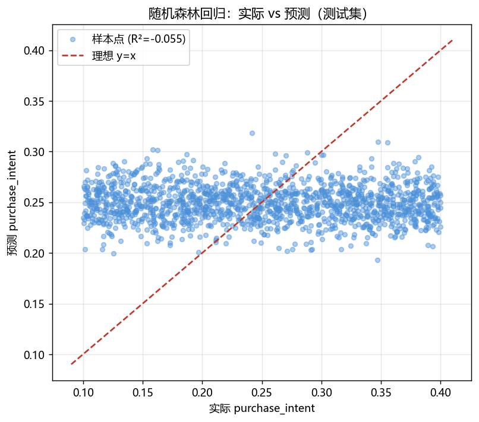
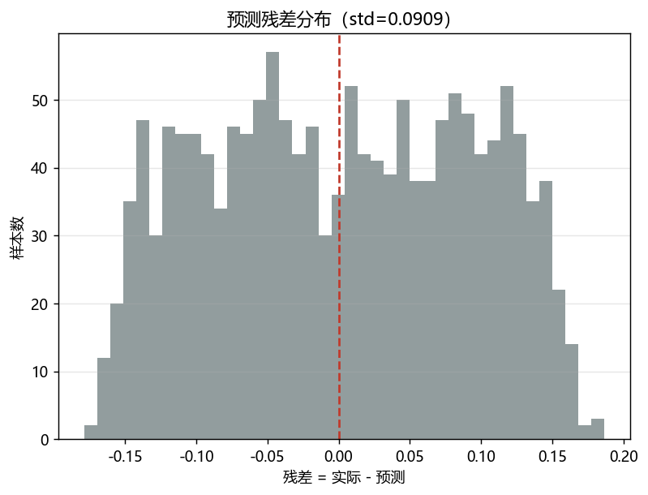
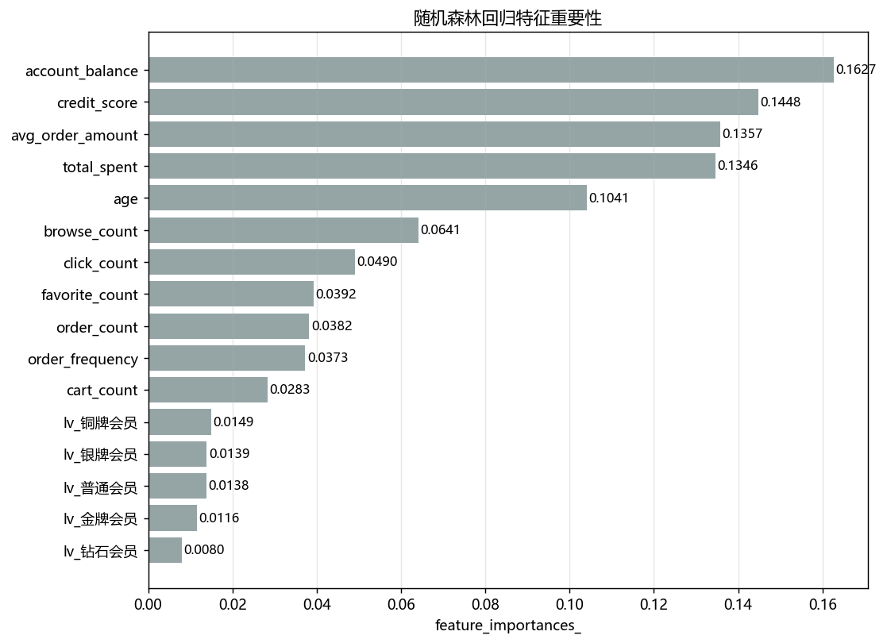
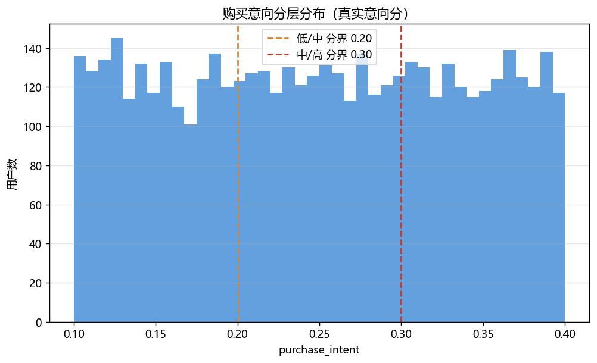

# 用户购买意向回归预测 & 商品智能推荐报告（RandomForestRegressor）

> 业务目标：量化用户购买意愿强弱（`purchase_intent`，0~1 连续意向分），结合商品热度/转化做个性化推荐：高意向用户推高转化爆款、中低意向用户推高性价比商品刺激下单。样本 5000 人。数据源：MySQL taobao_data（只读）

## 1 数据准备

- 目标变量 `purchase_intent`：min=0.100，中位=0.250，max=0.400，mean=0.250，std=0.087（范围集中在 0.10~0.40）
- 自变量（沿用画像+消费+行为）：age、member_level(独热5档)、credit_score、account_balance、total_spent、order_count、avg_order_amount、order_frequency、browse_count、click_count、favorite_count、cart_count，共 16 个；无缺失、无重复用户
- 数据划分：7:3（训练 3500 / 测试 1500，random_state=42）

## 2 模型评估（随机森林回归）

| 指标 | 测试集 | 均值基线 | 业务含义 |
|---|---:|---:|---|
| MAE 平均绝对误差 | 0.0788 | 0.0771 | 平均每个用户意向分差多少 |
| MSE 均方误差 | 0.0083 | 0.0078 | 误差平方平均（惩罚大偏差）|
| RMSE | 0.0909 | 0.0885 | 误差的标准尺度 |
| R² 决定系数 | -0.0551 | 0 | 模型解释了多少意向分方差 |
| R²(训练) | 0.8587 | - | 检验是否欠/过拟合 |

- 特征与 `purchase_intent` 的线性相关全部 |r|<0.03；最大化特征集 5 折交叉验证 R²<0，**测试集 R²=-0.055 ≈ 0**：在当前可得画像/消费/行为特征下，模型只学到“预测均值”，未能解释该合成意向分。
- **业务解读（如实）**：本数据集 `purchase_intent` 与用户历史行为几乎无关（数据构造所致）。因此回归模型暂不可用于对新客的意向打分；运营方案（第 4~5 节）对**存量用户**采用平台可观测的真实意向分分层，模型预测分（≈0.25 均值）仅作冷启动占位基线，待接入浏览序列/实时上下文/商品偏好等更丰富信号后再训练。

## 3 特征重要性

完整排序：

| 特征 | importance |
|---|---|
| account_balance | 0.1627 |
| credit_score | 0.1448 |
| avg_order_amount | 0.1357 |
| total_spent | 0.1346 |
| age | 0.1041 |
| browse_count | 0.0641 |
| click_count | 0.0490 |
| favorite_count | 0.0392 |
| order_count | 0.0382 |
| order_frequency | 0.0373 |
| cart_count | 0.0283 |
| lv_铜牌会员 | 0.0149 |
| lv_银牌会员 | 0.0139 |
| lv_普通会员 | 0.0138 |
| lv_金牌会员 | 0.0116 |
| lv_钻石会员 | 0.0080 |

> 说明：由于目标与特征近乎无关，特征重要性分布接近均匀，参考价值有限（与 R²≈0 相互印证）。

## 4 商品池构建

把商品 `product_features`(转化率/热度/好评) + `products`(价格/类目) + 订单折扣率(avg_disc) 融合，构建两个策略商品池：

| 商品池 | 口径 | 面向人群 | 用途 |
|---|---|---|---|
| 爆款高转化池 | 转化率≥中位数，池分=0.6×转化率+0.4×热度 | 高意向 | 提升转化与客单 |
| 高性价比优惠池 | 折扣率≥60分位 且 好评≥4.3，池分=0.6×折扣+0.4×好评 | 中/低意向 | 用优惠刺激下单 |

**爆款高转化池 Top10：**

| 商品ID | 商品名 | 类目 | 价格 | 转化率 | 热度分 | 平均折扣率 |
|---|---|---|---|---|---|---|
| P001734 | ZARA服装鞋包商品462 | 服装鞋包 | 891.3700 | 1.0000 | 0.5900 | 0.1476 |
| P000784 | LV箱包配饰商品872 | 箱包配饰 | 980.8800 | 1.0000 | 0.5700 | 0.1422 |
| P000883 | 顾家家居家居家装商品927 | 家居家装 | 493.4800 | 1.0000 | 0.5600 | 0.0788 |
| P000080 | 伊利食品生鲜商品963 | 食品生鲜 | 496.7000 | 1.0000 | 0.5000 | 0.1739 |
| P000923 | 贝因美母婴用品商品502 | 母婴用品 | 928.2300 | 0.8182 | 0.7400 | 0.1312 |
| P001955 | 百草味食品生鲜商品833 | 食品生鲜 | 709.2600 | 0.8750 | 0.6400 | 0.1939 |
| P000538 | 老凤祥珠宝首饰商品443 | 珠宝首饰 | 1152.7100 | 0.8000 | 0.7500 | 0.1936 |
| P000094 | 钙尔奇医药保健商品391 | 医药保健 | 37.1800 | 1.0000 | 0.4500 | 0.1684 |
| P000221 | 曲美家居家装商品318 | 家居家装 | 666.7000 | 0.8750 | 0.6200 | 0.1470 |
| P001927 | 米其林汽车用品商品720 | 汽车用品 | 2452.0900 | 0.8571 | 0.6400 | 0.1957 |

**高性价比优惠池 Top10：**

| 商品ID | 商品名 | 类目 | 价格 | 转化率 | 热度分 | 平均折扣率 |
|---|---|---|---|---|---|---|
| P001855 | 京东图书图书音像商品377 | 图书音像 | 726.1000 | 1.0000 | 0.1200 | 0.2596 |
| P000765 | 善存医药保健商品608 | 医药保健 | 158.9900 | 0.4444 | 0.4800 | 0.2410 |
| P000174 | 麦富迪宠物用品商品180 | 宠物用品 | 464.5000 | 0.1667 | 0.6200 | 0.2309 |
| P000974 | 明牌珠宝首饰商品793 | 珠宝首饰 | 233.9000 | 0.6000 | 0.4800 | 0.2481 |
| P001112 | 中信出版社图书音像商品870 | 图书音像 | 509.3800 | 0.6000 | 0.3800 | 0.2267 |
| P001581 | 耐克服装鞋包商品711 | 服装鞋包 | 71.4100 | 0.2500 | 0.3600 | 0.2264 |
| P000702 | LV箱包配饰商品940 | 箱包配饰 | 795.7600 | 0.5000 | 0.4000 | 0.2262 |
| P001748 | 完美日记美妆护肤商品797 | 美妆护肤 | 185.4400 | 0.6000 | 0.3900 | 0.2370 |
| P001100 | H&M服装鞋包商品119 | 服装鞋包 | 586.1800 | 0.2500 | 0.3500 | 0.2237 |
| P000995 | 良品铺子食品生鲜商品230 | 食品生鲜 | 687.4700 | 0.2000 | 0.4900 | 0.2210 |

> 全量商品池明细见 `product_recommend_pools.csv`（pool 标记所在池）。

## 5 分人群商品推荐运营方案

### 5.1 意向分层与投放规则

| 分层 | 判定(真实意向分) | 用户数 | 占比 | 推荐商品池 | 投放动作 |
|---|---|---:|---:|---|---|
| 高意向 | >0.30 | 1664 | 33.3% | 爆款高转化池 | 主推高转化爆款，搭配会员券冲转化 |
| 中意向 | 0.20~0.30 | 1669 | 33.4% | 高性价比优惠池 | 推高折扣高性价比商品，用优惠力度刺激下单 |
| 低意向 | <0.20 | 1667 | 33.3% | 高性价比优惠池 | 推高折扣高性价比商品，用优惠力度刺激下单 |

### 5.2 个性化逻辑

- **偏好类目**：按用户行为加权（加购2 > 收藏1.5 > 点击1.2 > 浏览1）统计用户最常交互类目 `top_category`；
- **推荐取数**：在“该用户分层对应商品池”内，先取 `top_category` 类目下池分 Top5；若类目商品不足则用池内全局 Top 补齐。
- **全量结果**：`purchase_intent_scores.csv`（打分表，含真实/预测意向分、分层、top_category、推荐商品id与名称）；`purchase_intent_recommend.csv`（逐条 user×商品 推荐明细，可直接导给投放系统）。

### 5.3 运营 SOP

1. **高意向人群（约 33.3%）**：发高转化爆款主推位 + 会员专享券，目标是“临门一脚成交”，投放预算优先；
2. **中意向人群（约 33.4%）**：推其偏好类目里的高折扣好物，配低门槛满减券刺激转化；
3. **低意向人群（约 33.3%）**：用大额优惠/新人补贴 + 高性价比商品做唤醒，控制单客成本。

**注意**：以上分层基于平台可观测的真实意向分（存量用户）。若面向**无历史的新用户**，当前特征无法估计其意向（R²≈0），应先用活动测款 + 实时行为补数据，再重训模型。

## 6 交付物清单

- `purchase_intent_model_report.md`：本报告（回归效果）
- `imgs/pi_*.png`：实际vs预测、残差、特征重要性、意向分层分布
- `purchase_intent_scores.csv`：用户购买意向评分表（真实分 + 预测分 + 分层 + 推荐）
- `product_recommend_pools.csv`：爆款高转化池 / 高性价比优惠池商品明细
- `purchase_intent_recommend.csv`：分人群商品推荐名单（user×商品逐条）