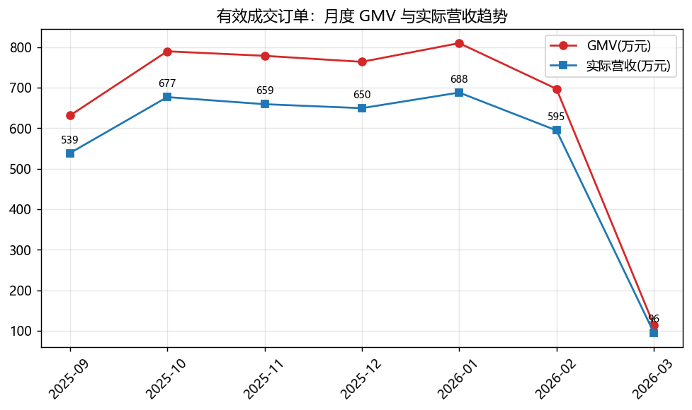
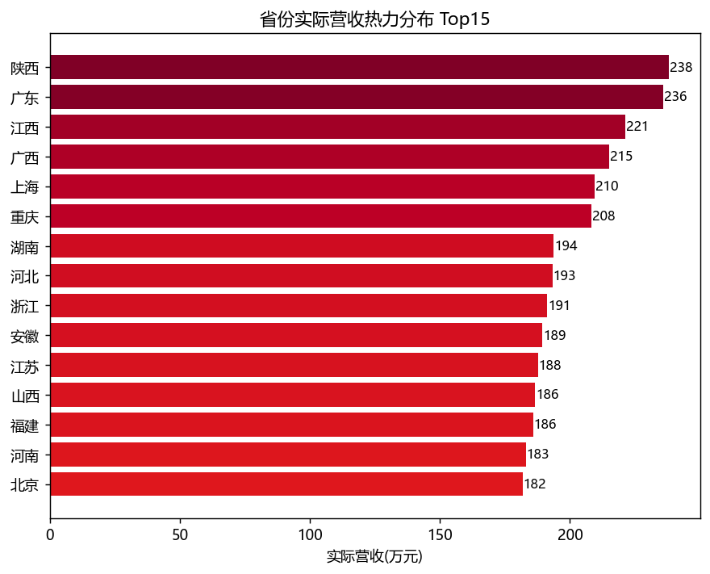
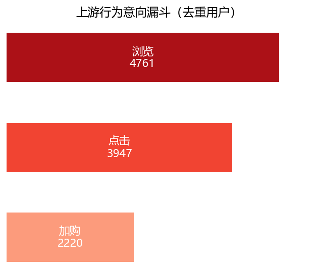

 # 电商经营健康度诊断报告

> 业务场景：月度经营复盘会
> 分析周期：**2025-09 ~ 2026-03**（约 6 个月，数据截至 2026-03-05，3 月为不完整月）
> 数据源：MySQL `taobao_data`（只读，未改动原始数据）
> 口径：**有效成交订单** = 订单状态 ∈ {已付款 / 已发货 / 已收货 / 已完成}；GMV = 有效订单 `total_amount` 合计；实际营收 = 有效订单 `actual_payment` 合计

---

## 一、核心结论速览（摘要）

1. **生意规模**：6 个月 GMV **4,585 万**，实际营收 **3,903 万**（折扣让利 682 万，占比约 14.9%）。
2. **钱从哪来**：营收呈强“二八”结构——**31.8% 的高消费人群贡献 71.3% 营收**；地域上陕西、广东、江西、广西、上海为 Top5；铜牌+银牌会员合计贡献 55.5% 营收。
3. **流量在哪流失最严重**：**浏览 → 点击 流失 17.1%（最高环节）**；此外取消(7.0%) + 退款(3.4%) 约 10.4% 的创建订单未能形成实收，是金额漏损最痛点。
4. **商品梯队**：A 类爆款 718 款贡献 **80.0% 营收**；热度分与梯队基本匹配（A 0.607 > B 0.539 > C 0.486）。

---

## 二、核心经营大盘

| 指标 | 计算逻辑 | 数值 | 业务含义 |
|---|---|---|---|
| GMV 总交易额 | 有效订单 `total_amount` 求和 | **45,851,112 元** | 平台流水规模 |
| 实际营收 | 有效订单 `actual_payment` 求和 | **39,026,324 元** | 真实到手收入 |
| 折扣让利 | 有效订单 `discount` 求和 | 6,824,788 元 | 促销让利成本 |
| 下单→收货转化率 | 收货完成订单 ÷ 全部创建订单 | 60.39% | 下单后最终完成的比率 |
| 支付转化率 | 有效成交订单 ÷ 全部创建订单 | 85.10% | 创建后真正付款的比率 |
| 行为支付转化率 | 有效支付用户 ÷ 有浏览行为用户 | 96.72% | 流量到付款的全链路转化 |
| 客单价（实收） | 实际营收 ÷ 有效支付用户 | 8,474.77 元 | 单个成交用户平均消费 |

订单规模：创建订单 **15,000** 笔 → 有效成交 **12,765** 笔 → 最终收货完成 **9,058** 笔。

> 📌 月度趋势：实际营收月均约 539~688 万，**2026-01 为峰值（约 688 万）**，2 月回落至约 595 万；**2026-03 只统计到 03-05，为不完整月（约 96 万），请勿解读为暴跌**。

---

## 三、钱从哪里来：用户分层

### 3.1 地域营收分布（Top5 高贡献省份）

| 省份 | 实际营收（元） | GMV（元） | 成交用户数 |
|---|---:|---:|---:|
| 陕西 | 2,380,952 | 2,754,120 | 262 |
| 广东 | 2,358,803 | 2,797,081 | 245 |
| 江西 | 2,211,782 | 2,594,818 | 241 |
| 广西 | 2,150,738 | 2,524,280 | 236 |
| 上海 | 2,095,154 | 2,485,335 | 232 |

> 📌 广东用户数最多，但**陕西人均贡献更高**（用户更少却营收第一），西部/华南市场值得精细化运营。

### 3.2 会员价值分层

| 会员等级 | 实际营收（元） | 营收占比 | 订单量 | 用户数 |
|---|---:|---:|---:|---:|
| 铜牌会员 | 11,506,488 | 29.5% | 3,777 | 1,355 |
| 银牌会员 | 10,160,628 | 26.0% | 3,285 | 1,194 |
| 普通会员 | 9,645,337 | 24.7% | 3,077 | 1,107 |
| 金牌会员 | 5,550,600 | 14.2% | 1,917 | 688 |
| 钻石会员 | 2,163,272 | 5.5% | 709 | 261 |

> 📌 **铜牌 + 银牌贡献 55.5% 营收**，是基本盘；钻石会员仅 261 人但人均客单最高，属“金字塔尖”高价值客群。

### 3.3 消费等级划分（user_features.consumption_level）

| 消费等级 | 人数 | 人数占比 | 实际营收（元） | 营收占比 |
|---|---:|---:|---:|---:|
| 高 | 1,589 | 31.8% | 27,809,202 | **71.3%** |
| 中 | 1,890 | 37.8% | 9,549,387 | 24.5% |
| 低 | 1,521 | 30.4% | 1,667,735 | 4.3% |

> 📌 高价值客群定位：**高消费人群（约 1/3 用户）贡献 7 成营收**，运营资源应向其倾斜（专属权益、新品优先触达）。

---

## 四、商品 ABC 销量分层（帕累托）

| 类别 | 定义 | 商品数（占比） | 营收（占比） | 平均 popularity |
|---|---|---|---|---|
| **A 类爆款** | 贡献前 80% 营收 | 718（35.9%） | 31,210,567（**80.0%**） | **0.607** |
| **B 类潜力款** | 中间 15% 营收 | 618（30.9%） | 5,861,311（15.0%） | 0.539 |
| **C 类长尾滞销** | 末尾 5% 营收 | 664（33.2%） | 1,954,446（5.0%） | 0.486 |

> 📌 **热度分与梯队基本匹配**（A > B > C），说明爆款识别可靠；但 C 类平均热度仍有 0.486，意味着存在“有曝光、无转化”的商品，可从选品/供给错配角度盘活。

### 4.1 爆款清单（A 类 Top10）

| 商品ID | 商品名 | 实际营收（元） | popularity |
|---|---:|---:|
| P000980 | 海康威视汽车用品商品432 | 240,475 | 0.62 |
| P001602 | 米其林汽车用品商品226 | 225,406 | 0.78 |
| P001695 | 苏泊尔家用电器商品681 | 225,032 | 1.02 |
| P000484 | 三星手机数码商品810 | 216,234 | 0.83 |
| P000413 | 戴森家用电器商品153 | 212,401 | 0.89 |
| P000940 | 美的家用电器商品123 | 200,272 | 0.92 |
| P001582 | 西门子家用电器商品753 | 183,029 | 0.87 |
| P000130 | 苹果手机数码商品741 | 182,808 | 0.94 |
| P000741 | 格力家用电器商品687 | 181,246 | 0.61 |
| P001140 | vivo手机数码商品604 | 179,354 | 0.64 |

> 分布特征：爆款集中在**家用电器 / 手机数码 / 汽车用品**类头部品牌。

### 4.2 滞销商品清单（C 类尾部样例）

> 说明：全库 **0** 款商品完全无成交**，但 C 类 664 款合计仅贡献 5% 营收，尾部营收趋近于 0。

| 商品ID | 商品名 | 实际营收（元） | popularity |
|---|---:|---:|
| P000782 | GUCCI箱包配饰商品259 | 9.57 | 0.16 |
| P000323 | 曲美家居家装商品770 | 78.41 | 0.70 |
| P000407 | pidan宠物用品商品948 | 82.99 | 0.53 |
| P000280 | 新华书店图书音像商品718 | 117.38 | 0.40 |
| P000378 | MK箱包配饰商品661 | 151.17 | 0.32 |
| P000699 | Swisse医药保健商品173 | 157.60 | 0.43 |
| P001911 | 博库网图书音像商品736 | 167.12 | 0.32 |
| P001454 | 金龙鱼食品生鲜商品209 | 181.43 | 0.54 |
| P001568 | 人民邮电出版社图书音像商品811 | 198.91 | 0.34 |
| P001396 | 五粮液食品生鲜商品476 | 209.11 | 0.62 |

---

## 五、订单生命周期流失漏斗

漏斗路径：**浏览 → 点击 → 加购 → 创建订单 → 支付 → 发货 → 收货完成**（去重用户数）。

### 5.1 上游行为意向漏斗

| 阶段 | 用户数 | 环比转化率 |
|---|---:|---:|
| 浏览 | 4,761 | — |
| 点击 | 3,947 | 82.9% |
| 加购 | 2,220 | 56.2%（加购非强制路径） |

> ⚠️ 注意：创建订单用户（4,743）多于加购用户（2,220），说明**大量用户未加购直接下单**，加购是可绕过的中间环节，不应把“加购→下单”理解为真实流失。

### 5.2 下游订单履约漏斗

| 阶段 | 用户数 | 环比转化率 | 流失率 |
|---|---:|---:|---:|
| 创建订单 | 4,743 | — | — |
| 支付 | 4,605 | 97.1% | 2.9% |
| 发货 | 4,472 | 97.1% | 2.9% |
| 收货完成 | 4,183 | 93.5% | **6.5%** |

### 5.3 流失痛点定位

- **最高流失环节 = 浏览 → 点击（流失 17.1%，绝对量 814 人）**：流量进来了却没被点开，需优化首屏/主推/推荐位。
- **履约末端“发货 → 收货”流失 6.5%**（用户级最高相对流失）：需关注物流时效与到货体验。
- **金额漏损最大来源在订单级**：待付款 673 单（4.5%）+ 已取消 1,054 单（7.0%）+ 已退款 508 单（3.4%）≈ **15% 创建订单未形成实收**，其中取消/退款合计约 10.4% → 支付唤起、履约、售后是挽回重点。

---

## 六、文字诊断结论

1. **流失痛点**：① 首屏/推荐环节承接差（浏览→点击流失 17.1%）；② 下单后取消+退款合计约 10.4%，需排查高取消/高退款商品的共性（价格、描述、履约）；③ 发货→收货体验环节流失 6.5%。
2. **高价值客群**：高消费人群（31.8% 用户 → 71.3% 营收）为绝对核心；会员上以铜牌+银牌为基本盘、钻石会员做尖塔经营；地域聚焦陕西、广东、江西、广西、上海 Top5。
3. **爆款清单**：A 类 718 款贡献 80% 营收，头部为家电/3C/汽车用品大牌（Top10 见 4.1），应保障库存与流量倾斜。
4. **滞销商品清单**：C 类 664 款仅 5% 营收（样例见 4.2），多为箱包/图书/家居家装尾部品，建议降价清仓或下架重选。

---

## 七、附录：口径与免责说明

- 分析全程只读 MySQL，未改动原始 CSV 与库内数据。
- 该数据为**仿真业务数据**：浏览→成交全链路转化（94.7%）显著高于真实电商，图表与结构适合方法演练，结论不宜直接用于真实经营决策。
- 2026-03 为不完整月，跨月对比时建议剔除或单独标注。

*配套脚本：`analysis/diagnose.py` ｜ 图表目录：`analysis/output/imgs/`*
